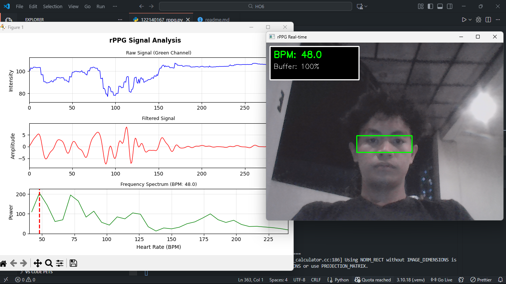
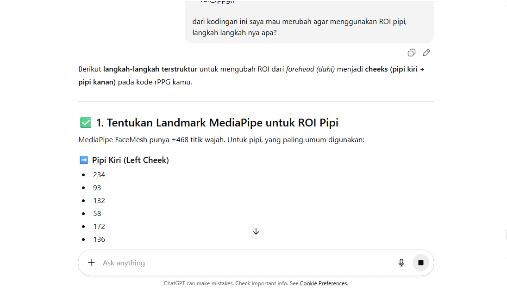

# Real-time Remote Photoplethysmography (rPPG)

Sistem ini menggunakan metode **Remote Photoplethysmography (rPPG)** untuk mendeteksi detak jantung (BPM) secara real-time dengan menganalisis sinyal dari video feed wajah yang diambil dari webcam. Sistem ini menggunakan **MediaPipe FaceMesh** untuk mendeteksi landmark wajah dan mengekstrak **pipi** sebagai daerah minat (ROI) untuk ekstraksi sinyal.

## Metodologi

### 1. **Ekstraksi Sinyal dari Pipi**:
   - Sistem ini mengekstrak channel hijau dari frame video yang diambil oleh webcam. Channel hijau dipilih karena memiliki korelasi yang kuat dengan perubahan aliran darah di bawah kulit, yang digunakan untuk mendeteksi detak jantung.

### 2. **Deteksi Wajah & ROI**:
   - **MediaPipe FaceMesh** digunakan untuk mendeteksi dan melacak landmark wajah. Pipi kiri dan kanan dipilih sebagai daerah minat (ROI) untuk ekstraksi sinyal, berdasarkan landmark 234-225 untuk pipi kiri dan 454-445 untuk pipi kanan.

### 3. **Pemrosesan Sinyal**:
   - **Filter Bandpass**: Sebuah **filter Butterworth bandpass** diterapkan untuk menghapus noise dari sinyal mentah, hanya mempertahankan rentang frekuensi yang terkait dengan detak jantung (0.67 - 4.0 Hz).
   - **Estimasi BPM**: **FFT (Fast Fourier Transform)** digunakan untuk memperkirakan frekuensi dominan dalam sinyal, yang kemudian dikonversi menjadi BPM.

### 4. **Penyaringan BPM**:
   - Untuk menghaluskan pembacaan BPM, sistem ini menggunakan rata-rata bergerak dari nilai BPM yang baru-baru ini dihitung, memastikan bahwa fluktuasi yang mendadak dapat diminimalkan.

### 5. **Visualisasi Real-Time**:
   - Sistem ini menyediakan pembaruan grafik secara real-time untuk sinyal mentah, sinyal yang telah difilter, dan spektrum frekuensi menggunakan **matplotlib**.
   - Nilai BPM ditampilkan langsung pada feed video secara real-time.

## Fitur
- **Pemantauan detak jantung secara real-time** menggunakan footage webcam.
- Deteksi **non-invasif** menggunakan channel hijau dari wajah.
- **Penghalusan output BPM** menggunakan buffer penghalusan.
- **Visualisasi** sinyal mentah, sinyal yang difilter, dan spektrum frekuensi.

## Hasil

### Referensi :
 
Teman : Ferdana Al- Hakim (122140012)

